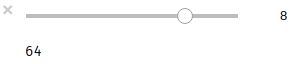
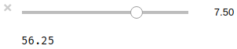
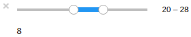
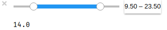
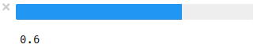
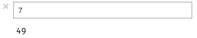
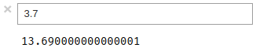
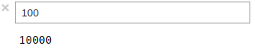
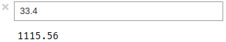

title: Jupyter本没原稿集#2.1 ipywidgets#1
date: 2017-09-23 14:00
tags: python, jupyter, ipywidgets

ボツネタ供養の第二弾です。ipywidgets のほぼ全てのウィジェットを大盤振る舞いして紹介しちゃいます。

## ウィジェット一覧

ipywidgets にはさまざまなウィジェットクラスが用意されています。

* Numeric ウィジェット
* Boolean ウィジェット
* Selection ウィジェット
* String ウィジェット
* Layout ウィジェット

今回は Numeric ウィジェットの説明と使い方の事例を紹介します。

### Numeric ウィジェット

数値型の値を扱うウィジェットです。

* IntSlider
* FloatSlider
* IntRangeSlider
* FloatRangeSlider
* IntProgress
* FloatProgress
* BoundedIntText
* BoundedFloatText
* IntText
* FloatText

引数|説明
---|---
value|初期値
min|最小値
max|最大値
step|ステップ数
description|ラベル
orientation|ウィジェットの向き

### IntSlider の使用例

int型を扱うスライダです。下記のコードでは値を2乗した結果を出力しています。

```python
from IPython.display import display, clear_output
from ipywidgets import IntSlider


def print_pow(change):
    clear_output()
    print(change['new'] ** 2)


int_slider = IntSlider(value=6, min=2, max=10, step=2)
int_slider.observe(print_pow, names='value')
display(int_slider)
```



### FloatSlider

float型を扱うスライダです。下記のコードでは値を2乗した結果を出力しています。

```python
from ipywidgets import FloatSlider

float_slider = FloatSlider(value=5.5, min=2, max=10, step=0.5)
float_slider.observe(print_pow, names='value')
display(float_slider)
```



### IntRangeSlider

2つの int型の値を扱うスライダです。下記のコードでは2つの値の差を出力しています。

```python
from ipywidgets import IntRangeSlider

def difference(change):
    clear_output()
    d, u = change['new']
    print(u - d)

int_range_slider = IntRangeSlider(value=(10, 20), min=5, max=40)
int_range_slider.observe(difference, names='value')
display(int_range_slider)
```



### FloatRangeSlider

2つの float型の値を扱うスライダです。下記のコードでは2つの値の差を出力しています。

```python
from ipywidgets import FloatRangeSlider

float_range_slider = FloatRangeSlider(value=(12.5, 17.5), min=5.5, max=27.5)
float_range_slider.observe(difference, names='value')
display(float_range_slider)
```



### IntProgress

int型のプログレスバーです。`value` プロパティに値を加算することで、プログレスバーの内容が更新されます。

```python
from ipywidgets import IntProgress
from time import sleep

int_progress = IntProgress(min=0, max=10)
display(int_progress)

for i in range(10):
    clear_output()
    print(int_progress.value)
    int_progress.value += 1
    sleep(1)
```


### FloatProgress

float型のプログレスバーです。`value` プロパティに値を加算することで、プログレスバーの内容が更新されます。

```python
from ipywidgets import FloatProgress

float_progress = FloatProgress(min=0, max=1)
display(float_progress)

for i in range(10):
    clear_output()
    print(float_progress.value)
    float_progress.value += .1
    sleep(1)
```



### BoundedIntText

int型の数値を入力するテキストボックスです。最小値や最大値を設定して、入力範囲を制限できます。下記のコードでは値を2乗した結果を出力しています。

```python
from ipywidgets import BoundedIntText

BoundedIntText()

bounded_int_text = BoundedIntText(value=5, min=2, max=10)
bounded_int_text.observe(print_pow, names='value')
display(bounded_int_text)
```



### BoundedFloatText

float型の数値を入力するテキストボックスです。最小値や最大値を設定して、入力範囲を制限できます。下記のコードでは値を2乗した結果を出力しています。

```python
from ipywidgets import BoundedFloatText

bounded_float_text = BoundedFloatText(value=5.5, min=2.5, max=7.5)
bounded_float_text.observe(print_pow, names='value')
display(bounded_float_text)
```



### IntText

int型の数値を入力するテキストボックスです。`BoundedIntText` と異なり、値の制限はありません。下記のコードでは値を2乗した結果を出力しています。

```python
from ipywidgets import IntText

int_text = IntText(value=5)
int_text.observe(print_pow, names='value')
display(int_text)
```



### FloatText

float型の数値を入力するテキストボックスです。`BoundedFloatText` と異なり、値の制限はありません。下記のコードでは値を2乗した結果を出力しています。

```python
from ipywidgets import BoundedFloatText

bounded_float_text = BoundedFloatText(value=5.5, min=2.5, max=7.5)
bounded_float_text.observe(print_pow, names='value')
display(bounded_float_text)
```




Jupyter本没原稿集#2.2に続きます。