.. article::
   :title: Jupyter本没原稿集#2.2 ipywidgets#2
   :date: 2018-01-19
   :tags: python, jupyter, ipywidgets, bokeh

| ボツネタ供養の第三弾です。\ `前回 <https://drillan.github.io/articles/jupyterbook_reject02.html>`__\ から大分間が空いてしまいました。申し訳ありません...
| 今回は残りすべてのウィジェットを紹介します。

ToggleButton
~~~~~~~~~~~~

トグルボタンです。ボタンをクリックすると真偽値が切り替わり、状態が保持されます。以下のコードでは2つの値の論理積を出力しています。

.. code:: python

    from ipywidgets import ToggleButton

    def x_and_y(change):
        clear_output()
        print(toggle_button_x.value & toggle_button_y.value)

    toggle_button_x = ToggleButton(description='x')
    toggle_button_y = ToggleButton(description='y')
    toggle_button_x.observe(x_and_y, names='value')
    toggle_button_y.observe(x_and_y, names='value')
    display(toggle_button_x, toggle_button_y)

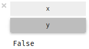

   ToggleButton のサンプルコード

Checkbox
~~~~~~~~

チェックボックスです。チェックをした状態が
``True``\ 、チェックを外した状態が ``Fales``
となります。以下のコードでは2つの値の論理積を出力しています。

.. code:: python

    from ipywidgets import Checkbox

    def x_and_y(change):
        clear_output()
        print(checkbox_x.value & checkbox_y.value)

    checkbox_x = Checkbox(description='x')
    checkbox_y = Checkbox(description='y')
    checkbox_x.observe(x_and_y, names='value')
    checkbox_y.observe(x_and_y, names='value')
    display(checkbox_x, checkbox_y)

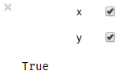

   Checkbox のサンプルコード

Valid
~~~~~

真偽値の状態を示すインジケータです。このインスタンスに対して変更はできません。

.. code:: python

    from ipywidgets import Valid

    def is_valid(change):
        valid.value = change['new']

    checkbox_valid = Checkbox(description='valid')
    valid = Valid(value=False)
    checkbox_valid.observe(is_valid, names='value')
    display(checkbox_valid, valid)

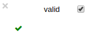

   widgets\_name のサンプルコード

Dropdown
~~~~~~~~

ドロップダウンから値を選択します。以下のコードはキャラクター名を選択するとそのキャラクターの正体が出力されます。

.. code:: python

    from ipywidgets import Dropdown

    def sos(change):
        clear_output()
        ans = {'朝比奈': '未来人', '長門': '宇宙人', '古泉': '超能力者'}
        print(ans[change['new']])

    dropdown = Dropdown(options=['朝比奈', '長門', '古泉'])
    dropdown.observe(sos, names='value')
    display(dropdown)

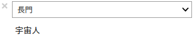

   Dropdown のサンプルコード

RadioButtons
~~~~~~~~~~~~

ラジオボタンから値を選択します。以下のコードはキャラクター名を選択するとそのキャラクターの正体が出力されます。

.. code:: python

    from ipywidgets import RadioButtons

    radio_buttons = RadioButtons(options=['朝比奈', '長門', '古泉'])
    radio_buttons.observe(sos, names='value')
    display(radio_buttons)

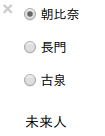

   Dropdown のサンプルコード

Select
~~~~~~

リストボックスから値を選択します。以下のコードはキャラクター名を選択するとそのキャラクターの正体が出力されます。

.. code:: python

    from ipywidgets import Select

    select = Select(options=['朝比奈', '長門', '古泉'])
    select.observe(sos, names='value')
    display(select)

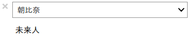

   Select のサンプルコード

SelectionSlider
~~~~~~~~~~~~~~~

スライダから値を選択します。以下のコードはキャラクター名を選択するとそのキャラクターの正体が出力されます。

.. code:: python

    from ipywidgets import SelectionSlider

    selection_slider = SelectionSlider(options=['朝比奈', '長門', '古泉'])
    selection_slider.observe(sos, names='value')
    display(selection_slider)

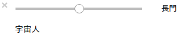

   SelectionSlider のサンプルコード

ToggleButtons
~~~~~~~~~~~~~

トグルボタンから値を選択します。以下のコードはキャラクター名を選択するとそのキャラクターの正体が出力されます。

.. code:: python

    from ipywidgets import ToggleButtons

    toggle_buttons = ToggleButtons(options=['朝比奈', '長門', '古泉'])
    toggle_buttons.observe(sos, names='value')
    display(toggle_buttons)

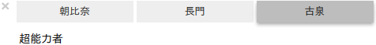

   ToggleButtons のサンプルコード

SelectMultiple
~~~~~~~~~~~~~~

``Ctrl`` キーまたは ``Shift``
キーを押しながら複数の値を選択できます。以下のコードは定義した辞書から組み合わせに応じた結果が出力されます。

.. code:: python

    from ipywidgets import SelectMultiple

    def relation(change):
        clear_output()
        ans = {('岡部倫太郎',): '鳳凰院凶真', ('阿万音鈴羽',): '未来人', ('橋田至',): 'スーパーハカー',
               ('岡部倫太郎', '阿万音鈴羽'): 'バイト戦士', ('岡部倫太郎', '橋田至'): 'ダル',
              ('阿万音鈴羽', '橋田至'): '親子', ('岡部倫太郎', '阿万音鈴羽', '橋田至'): 'ラボメン'}
        print(ans[change['new']])

    select_multiple = SelectMultiple(options=['岡部倫太郎', '阿万音鈴羽', '橋田至'])
    select_multiple.observe(relation, names='value')
    display(select_multiple)

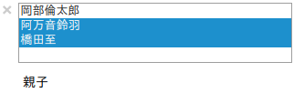

   SelectMultiple のサンプルコード

Text
~~~~

テキストボックスです。以下のコードでは入力した文字列を式として評価した結果を出力します。\ ``.on_submit()``
メソッドはテキストボックス上で ``Enter``
キーが入力されたイベントをハンドリングします。

.. code:: python

    from ipywidgets import Text

    def calc(submit):
        clear_output()
        try:
            print(eval(submit.value))
        except Exception:
            print('Error')

    text = Text()
    text.on_submit(calc)
    display(text)

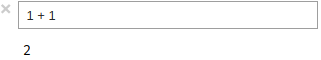

   Text のサンプルコード

Textarea
~~~~~~~~

複数行を入力できるテキストボックスです。以下のコードでは入力した文字数をカウントした結果を出力します。

.. code:: python

    from ipywidgets import Textarea

    def wc(change):
        clear_output()
        print(len(change['new']))

    textarea = Textarea()
    textarea.observe(wc, names='value')
    display(textarea)

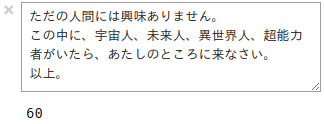

   Textarea のサンプルコード

Label
~~~~~

ラベルを表示します。このインスタンスに対して入力は受け付けません。以下のコードでは
LaTeX 書式にて記述しています。数式の記述については
`書籍 <https://www.amazon.co.jp/Python%E3%83%A6%E3%83%BC%E3%82%B6%E3%81%AE%E3%81%9F%E3%82%81%E3%81%AEJupyter-%E5%AE%9F%E8%B7%B5-%E5%85%A5%E9%96%80-%E6%B1%A0%E5%86%85-%E5%AD%9D%E5%95%93/dp/4774192236/ref=as_li_ss_tl?ref_=nav_signin&&linkCode=ll1&tag=eleshis-22&linkId=12c20401ddd3c71f971ac2330621cdd6>`__
にて解説します。

.. code:: python

    from ipywidgets import Label

    Label(value='$E=mc^2$')

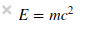

   Label のサンプルコード

HTML
~~~~

値を HTML として出力します。以下のコードでは簡易的な HTML
エディタを作成しています。

.. code:: python

    from ipywidgets import HTML

    def html_editor(change):
        html.value=change['new']

    html = HTML()
    textarea = Textarea()
    textarea.observe(html_editor, names='value')
    display(textarea, html)

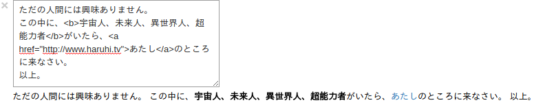

   HTML のサンプルコード

HTMLMath
~~~~~~~~

値を HTML として出力します。数式を含むことができます。

.. code:: python

    from ipywidgets import HTMLMath

    HTMLMath(value='<b>ものすごく</b>有名な式:  $E=mc^2$')

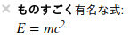

   HTMLMath のサンプルコード

Image
~~~~~

画像ファイルを表示します。

.. code:: python

    from ipywidgets import Image
    from urllib.request import urlopen

    url = 'https://www.python.org/static/img/python-logo.png'
    res = urlopen(url)
    Image(value=res.read(), width=290, height=82)

   Image のサンプルコード

Button
~~~~~~

ボタンです。ボタンが押された際に、\ ``on_click()``
メソッドがイベントハンドラとなります。以下のコードでは乱数で生成した値を出力しています。

.. code:: python

    from ipywidgets import Button
    from random import randint

    def omikuji(submit):
        clear_output()
        data = {0: 'ハルヒ', 1: '長門', 2: '朝比奈さん', 3: '小泉'}
        print(data[randint(1, 3)])

    button = Button(description='誰と組む？')
    button.on_click(omikuji)
    display(button)

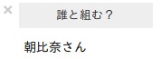

   Button のサンプルコード

Play
~~~~

アニメーションを制御します。再生、一時停止、停止ボタンが用意されています。以下のコードでは
`書籍の7章 <https://www.amazon.co.jp/Python%E3%83%A6%E3%83%BC%E3%82%B6%E3%81%AE%E3%81%9F%E3%82%81%E3%81%AEJupyter-%E5%AE%9F%E8%B7%B5-%E5%85%A5%E9%96%80-%E6%B1%A0%E5%86%85-%E5%AD%9D%E5%95%93/dp/4774192236/ref=as_li_ss_tl?ref_=nav_signin&&linkCode=ll1&tag=eleshis-22&linkId=12c20401ddd3c71f971ac2330621cdd6>`__
で紹介したアニメーションをウィジェットで制御しています。

.. code:: python

    from ipywidgets import Play, Layout
    from bokeh.plotting import figure
    from bokeh.io import output_notebook, show, push_notebook
    from numpy import arange, sin, pi

    output_notebook()

    def calc_sin(i):
        return sin(x + i / 10.0)

    def update_graph(change):
        r.data_source.data = {'x': x, 'y': calc_sin(change['new'])}
        push_notebook(handle=t)

    p = figure(plot_width=400, plot_height=200)
    x = arange(0, 2 * pi, 0.01)
    r = p.line(x, calc_sin(0))

    play = Play(layout=Layout(width='20%'))
    slider = IntSlider()
    play.observe(update_graph, names='value')

    t = show(p, notebook_handle=True)
    display(play)

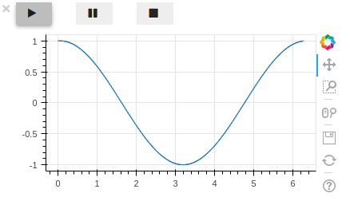

   Play のサンプルコード

DatePicker
~~~~~~~~~~

カレンダーから日付を入力します。以下のコードでは入力された日付とコンピュータの日付の差分を日数で出力しています。

.. code:: python

    from ipywidgets import DatePicker
    from datetime import datetime

    def weekday(change):
        clear_output()
        days_diff = (change['new'] - datetime.now().date()).days
        if days_diff >= 0:
            print('{}日後'.format(days_diff))
        else:
            print('{}日前'.format(abs(days_diff)))

    date_picker = DatePicker()
    date_picker.observe(weekday, names='value')
    display(date_picker)

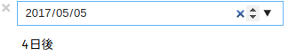

   DatePicker のサンプルコード

ColorPicker
~~~~~~~~~~~

見本リストから色を選択します。値は16進数のRGB表記です。以下のコードでは選択された色を10進数のRGB表記に変換し、HTML
で表示しています。

.. code:: python

    from ipywidgets import ColorPicker, jslink

    def change_color(change):
        color16 = change['new']
        r = int(color16[1:3], 16)
        g = int(color16[3:5], 16)
        b = int(color16[5:7], 16)
        html_text = 'R:{1}, G:{2}, B:{3}'
        html_text = html_text.format(color16, r, g, b)
        color_text.value = html_text

    color_picker = ColorPicker()
    color_text = HTML()
    color_picker.observe(change_color, names='value')
    display(color_picker, color_text)

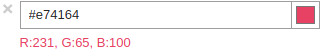

   DatePicker のサンプルコード